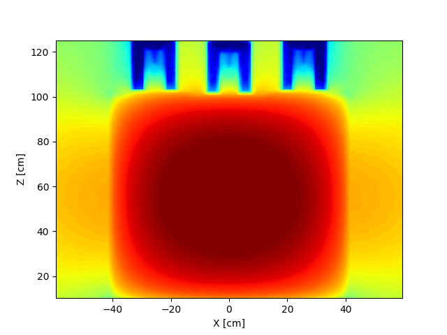

# mcnp_meshtal_python_processor MMPP
A processing script to convert MCNP meshtal files to python data structures. This can be used to make pretty pictures like ...




## Check out [example_usage.py](example_usage.py) and [TestMeshTally.msht](TestMeshTally.msht)
All you need is the file `MMPP.py`. Using the module is simple:
- Simply import the module:
    ```python 
    import MMPP
    ```
- Then read the meshtal file into one or more data blocks. Each data block corresponds to a single mesh-tally:
    ```python 
    data_blocks = MMPP.ReadMeshtalfile("TestMeshTally.msht")
    ```
- Then use any of the utility methods on a given data block:
    ```python 
    y,z,values,uncertainty = data_blocks[0].UnpackGivenXE_bins(0,0)
    ```

## Utility functions
- UnpackGivenXYE. Data along a z-line.
- UnpackGivenXZE. Data along a y-line.
- UnpackGivenYZE. Data along a x-line.
- UnpackGivenXE_bins. 2D data along YZ. Specified by bin number.
- UnpackGivenYE_bins. 2D data along XZ. Specified by bin number.
- UnpackGivenZE_bins. 2D data along XY. Specified by bin number.
- UnpackGivenXE. 2D data along YZ. Specified by x-value.
- UnpackGivenYE. 2D data along XZ. Specified by y-value.
- UnpackGivenZE. 2D data along XY. Specified by z-value.
